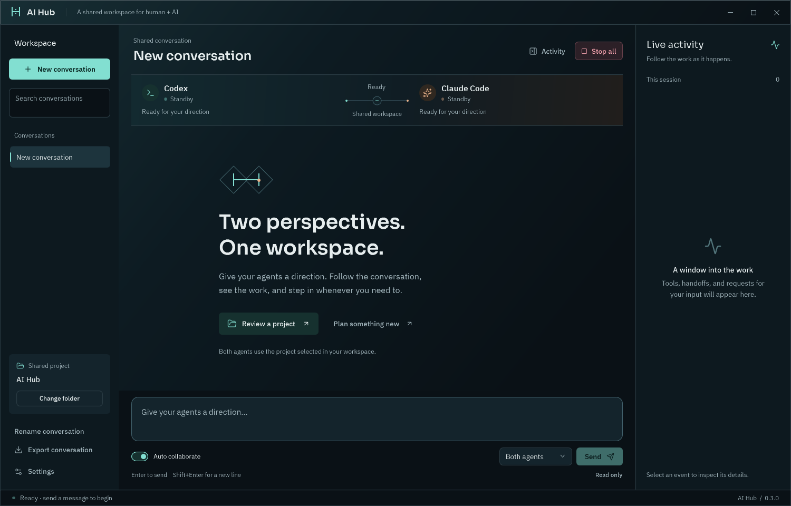

# AI Hub

A Windows desktop room for you, Codex, and Claude Code. Send one message to both agents, read their contributions in a shared conversation, and inspect live tools and handoffs in the activity panel. Structured replies appear once after their terminal result is committed; quiet checks stay in activity.

## Open it

Double-click **AI Hub** on your desktop, or run **Launch AI Hub.cmd** in this folder. The compiled application is `app\AI Hub.exe`.

1. Use **Change folder** to select the project you want to discuss.
2. Leave **Both agents** selected and send a message. Enter sends; Shift+Enter adds a line.
3. With **Both agents**, every contribution gives the other agent an opportunity to react: contribute something specific or pass quietly. A pass stays in task history; exact and near-repeated answers are hidden. The phase ends when everyone has passed on the newest events, when a greeting or exact short answer has been answered once, or at the round limit. **Auto collaborate** off gives each agent exactly one opportunity. A blocked task, a request for your input, or invalid messages after bounded repairs pause it.
4. While agents are working, sending a message adds it to the shared live stream: both agents see it at their next opportunity and the running turn is not interrupted. **Stop all** cancels agents in every conversation, including background tasks, and terminates their owned CLI process trees. A message sent while the conversation is idle starts a new phase with fresh sessions.
5. Select an activity event to inspect its full details. Use **Export conversation** to save the visible chat as Markdown.

An exchange also pauses if a provider disconnects, fails, or returns no reply. Opening the app or switching conversations never starts an exchange by itself. With automatic exchange off, both selected agents can contribute once; requests for further turns stay in history. Sending to only one agent makes a single targeted turn.

With **Both agents** selected, both receive the current message and the same initial common context. One speaks while the other prepares tentative notes without execution tools. Before speaking, the waiting agent receives the first response and updated context, revises its contribution, and can pass quietly. Preparation is never published directly. Address one by name (for example, **Claude, review this**) to choose who starts. A correction during active work keeps the interrupted speaker first unless you address the other agent; completed exchanges alternate the starting agent. Select **Codex only** or **Claude only** for an exclusive reply. Stop, failure, a blocked turn, and split research cancel unused preparation. Preparation adds a provider call and is not a promise of lower latency or cost.

The default limit is **six automatic rounds** after the initial replies; each round is one turn per agent. Adjust it from 1–50 in Settings. A pause banner and chat notice explain the reason. **Continue task** starts another run after you review progress; it never replaces an existing draft. For a greeting, a completed task, or a question awaiting your answer, use **Write a message** instead. Automatic collaboration uses normal provider usage or billing; the round limit is not a token or spending cap.

## Interface

Planned work is tracked in [docs/TODO.md](docs/TODO.md). AI Hub is released under the [MIT License](LICENSE).

Version **0.25.0** keeps workspace fingerprints on disk between runs, so the first message after a launch is as fast as the rest, and stops taking a snapshot for status-only messages such as a greeting's reply. See [fingerprint cache 0.25.0](docs/FINGERPRINT-CACHE-0.25.0.md).

Version **0.24.0** makes GPT-6.1 Sol the default Codex model when Settings leaves the model blank, with a one-time fallback to the CLI's own default if the install rejects it. See [default model 0.24.0](docs/DEFAULT-MODEL-0.24.0.md).

Version **0.23.0** closes the review's last carried-over items: each conversation's transcript is its own file and only rewritten when it changed, a review stays fresh while the files it names are unchanged even if unrelated files moved on, and the test runner reports failures instead of crashing. See [remaining items 0.23.0](docs/REMAINING-0.23.0.md).

Version **0.22.0** adds experimental per-agent worktrees: in a git project with edits enabled, Codex and Claude Code each edit in their own worktree, the Hub merges each turn into an integration branch and reports conflicts instead of resolving them, and your project folder changes only when you choose Merge into project. See [worktrees 0.22.0](docs/WORKTREES-0.22.0.md).

Version **0.21.0** adds bounded recovery: a provider process that dies mid-turn is restarted with backoff (30 s to 30 min, six attempts) and resumes the same native session, so the turn continues instead of the run failing. See [recovery 0.21.0](docs/RECOVERY-0.21.0.md).

Version **0.20.0** adds experimental mid-turn push: with the setting on, a message you send while Claude Code is working reaches it inside that turn through a channel, verified against your Claude Code build before enabling. See [mid-turn push 0.20.0](docs/MIDTURN-PUSH-0.20.0.md).

Version **0.19.0** ships the second batch: @mention addressing anywhere in a message, with a message that mentions both agents giving each its own part; resume commands for each native session in the Tasks window; an adversarial review workflow selectable per review; and per-phase provider usage totals. See [peer features 0.19.0](docs/PEER-FEATURES-0.19.0.md).

Version **0.18.0** ships the first batch from that list: an inactivity watchdog that stops a silent turn, quota-aware scheduling that remembers when a provider's limit resets and skips it until then, tiered delta prompts, edit collision detection between the two agents, a phase completion gate that names what is left outstanding, a disputed finding disposition, and a review packet export. See [peer features 0.18.0](docs/PEER-FEATURES-0.18.0.md).

Version **0.17.0** makes replies faster: workspace fingerprints reuse the hash of every unchanged file, a provider that is over its usage limit sits out the phase while the other agent still answers, and casual greetings get one quick reply. See [responsiveness 0.17.0](docs/RESPONSIVENESS-0.17.0.md).

Version **0.16.0** finishes the design review: large files no longer make reviews impossible, a stopped run cannot disturb the next one, a re-keyed native session is reported instead of killing the provider, ledgers are recovered on first use with a bounded cache, conversation records are archived at the cap instead of stopping the task, shared checks can be reused after a restart, and the desktop saves and refreshes only when something changed. See [hardening 0.16.0](docs/HARDENING-0.16.0.md).

Version **0.15.0** hardens the host against the highest-impact findings of the design review: native evidence is captured on a background chain instead of the provider's output reader, a review whose files changed is set aside for resubmission instead of failing the run, a failed final task write can no longer leave a task permanently owned, only invalid structured submissions spend the repair budget, the pipe listener survives connection errors, exact-input manifests are pruned instead of stopping a long task, unchanged transcript entries are no longer re-imported every turn, and closing the window is bounded. See [hardening 0.15.0](docs/HARDENING-0.15.0.md).

Version **0.14.0** completes the target design's turn-taking and user participation. Turns are reaction opportunities rather than host-scheduled slots: after each contribution or user message, every other participant may contribute or pass, explicit peer requests go first, and the phase ends when everyone passes. A message sent while agents work joins the live stream without stopping them; Stop all remains the explicit interrupt. Local diagnostics records a stream imbalance when one agent contributes three or more times in a phase while the other never does. See [live stream 0.14.0](docs/LIVE-STREAM-0.14.0.md).

Version **0.13.0** keeps each agent's provider session resident for the whole phase instead of starting a new process for every turn. Both agents receive the full common context once, at the start of the phase; every later turn in the phase supplies only the new events since their last turn: the user's messages, pinned instructions, the peer's contributions, quiet passes, research results and finished native commands. The same ordered stream is available to the agents through the `get_events` tool and is saved with the task. Synthesis after split research still receives the rebuilt context. This is the first step of the [target design](docs/LIVE-STREAM-0.13.0.md): one shared live stream for the user and both agents.

Version **0.12.0** adds **Local diagnostics**, the pulse-icon button beside **Tasks and notes** in the Shared project panel. AI Hub keeps a bounded, metadata-only record of provider errors, conversation-save failures, recovery notices, suppressed repeats, round limits, suspected five-minute stalls, and unhandled application errors: category, count, first and last time, room and task references, exception type, and the app version that recorded it. Chat text, prompts, tool output, and exception messages are never stored. Open the report to read it, **Export report** to save it as Markdown, or **Prepare agent review** to create a separate read-only conversation with the report as its draft; you decide when to send it, and nothing runs periodically. **Settings → Collect local diagnostics** turns collection off while keeping existing findings. See [local diagnostics verification](docs/LOCAL-DIAGNOSTICS-0.12.0.md).

Version **0.9.0** includes the shared-participation correction developed in the 0.7.1 candidate. Both selected agents get an opportunity to contribute without an explicit handoff, the starting agent rotates on unaddressed follow-ups, and routine status receipts remain in task history. Quiet peer checks and parallel context gathering are described in [release verification](docs/SHARED-CONTEXT-0.8.0.md).

The v0.3 mission-control interface pairs a graphite and teal workspace with a copper identity for Claude, bundled Sora and IBM Plex fonts, open conversation surfaces, and a focused composer. The collaboration instrument shows actual agent states, current actions, automatic round counts, and directional handoffs. It remains visible when the activity timeline is closed.

Use **Activity** beside **Stop all** to show or hide the timeline. It collapses automatically below 1280 device-independent pixels, unless you explicitly choose its visibility for the current window. Agent questions and permission requests appear directly in the chat and identify the agent waiting for you. Replies render Markdown headings, lists, code blocks, quotes, links, and tables. **Copy** retains the original Markdown.

For a question, select a choice and press **Enter**, or type an answer in the normal message box. **Shift+Enter** adds a line. Claude questions can allow several choices; Codex questions only offer a custom answer when the provider allows it. **Answering [agent]** above the composer shows the recipient, and **Show question** brings the active card into view. **Type an answer** switches to another pending question without losing either draft. An ordinary unsent message is kept separately and restored when questions finish. Answering resumes the waiting request; it does not start a new task or broadcast your answer to the other agent. The question and your reply remain in the transcript. Inputs marked private by Codex use a masked field, and AI Hub saves a placeholder instead of the answer. Providers still receive that answer and may retain it in their own session history.

Permission cards require **Allow once** or **Decline**. Switching conversations preserves pending cards and their answer drafts; return to the originating conversation to answer. **Stop all**, archive/delete of that conversation, or closing the app cancels its pending cards. Old cards remain readable and cannot be answered after restart.

Live activity shows actions and results: reads, searches, commands, file changes, handoffs, approvals and errors. Each tool action has one entry that updates as it runs; output chunks and completion update that entry. Select it to inspect its output. **Show diagnostics** exposes recent raw provider events, including connection messages and token counters; this preference is saved. **Open full log** opens the conversation's complete recorded activity in Notepad. The default action view omits routine counters and blank output rows without deleting their log evidence.

One short entrance sequence introduces the workspace. A directional signal travels only when an agent sends a real peer handoff; working indicators pulse during activity. Enable **Reduce motion** in Settings to disable movement. The app also respects Windows' client-area animation preference and suspends effects while minimized. There are no simulated system metrics or idle spinning indicators. Changing reduced motion does not interrupt an agent session. The native WPF controls and bundled fonts work without downloading visual assets at runtime.



The design direction and rationale are recorded in [DESIGN.md](DESIGN.md).

Drafts and recipients are saved per conversation; reopening AI Hub restores your last selected room. Search the sidebar by conversation name or project path. Rename conversations to organize ongoing work. When you scroll up in a long conversation, **Latest messages** takes you back to the bottom. Copy buttons briefly show a check mark after copying.

Use **Archive conversation** to keep a conversation while removing it from the active list. Choose **Archived conversations** above the sidebar list to find it again; search works within the selected view. Archived conversations remain readable and exportable, with their drafts and recipients intact. **Restore to continue** returns one to the active list without starting the agents.

**Delete** asks for confirmation before permanently removing the selected conversation's local AI Hub transcript, draft, tasks, notes, collaboration ledgers, saved long-message sources, and matching activity log. Project files, other conversations, and the providers' own account/session history are kept. Archiving or deleting a working conversation first cancels its agents and pending approvals. AI Hub selects another active conversation afterward, or creates an empty one when none remain. Canceling the deletion keeps the current work running.

## Shared project status

Choose a project, then click **Check status** in the Shared project panel. Simple messages such as **status check** or **check project status** use the same workflow. Selecting a folder alone never starts the agents.

With **Both agents** selected, one agent owns inspection and the other receives its findings for a focused review. The visible assignment explains the roles. **Settings → Project status inspector** chooses the inspector (Codex by default); a single-agent recipient inspects alone. Status checks always use read-only permissions and fresh task sessions, preserving each conversation's ordinary provider history. They end after inspection/review, even with Auto collaborate on.

The latest complete report is shared by conversations using the same project and status configuration. AI Hub fingerprints file contents, paths, Git branch/commit and index where available. A matching report younger than 30 minutes is reused with **no new model turns**. Edited, added or deleted files in scope invalidate it, including further edits to already-dirty files. The host hashes files locally; it does not send their contents to either model. This trades bounded local disk I/O for fewer repeated model inspections.

Open **⋯** beside Check status to **Refresh status** explicitly or **Forget saved status**. Neither action discards your draft. Forgetting clears the reusable report while retaining existing chat messages. Archiving keeps the report; deleting the conversation that created the latest report also clears that report. Other conversations, including copies of reports already shown there, remain intact.

Git projects include tracked and non-ignored files within the selected folder. Folder projects exclude `.git`, `.hg`, `.svn`, `bin`, `obj`, `node_modules`, `artifacts`, `dist`, `.venv`, `venv`, `__pycache__`, `.vs`, `.idea`, `.next`, and `coverage` directories. Linked paths, inaccessible files, nested Git submodule content, or limits of 10,000 files / 8 MiB per file / 128 MiB total disable reuse and produce a visible limitation. Source changes during a check also prevent caching. This checks local source freshness; external services, environment changes and agent conclusions are not certified. Force a refresh when those assumptions change.

Tool events and actual provider usage remain visible in Activity. Findings without evidence are labeled unverified; supported paths establish provenance, not proof that a claim or test result is true. The review assignment discourages duplicate discovery, but the app does not audit every provider file read.

## Tasks and notes

Version **0.10.0** adds concurrent preparation and shared work claims. Before substantial discovery or checks, cooperating agents can claim the work or reuse a matching completed result. Checks require captured native evidence and matching recorded inputs within the current run; independent review still requires fresh evidence. Calls made outside this protocol are not automatically deduplicated. Shared context shows work ownership, results, and evidence references. After split research, both findings enter one synthesis without an automatic extra general peer turn. See the [implementation checklist](docs/COLLABORATION-0.10.0-CHECKLIST.md).

Version **0.9.0** adds a host-owned shared task context. Each new user work phase starts fresh provider sessions supplied with active original user instructions, attributed findings, assignments, and recent conversation. Both researchers receive the same frozen common snapshot, and their findings enter the main continuation automatically. The models retain separate internal context windows.

Open **Tasks and notes → Shared context** to inspect, pin, or replace user instructions and see exact recent host inputs, byte counts, hashes, and omissions. Replacement retains the original as historical and stops affected work before changing it. Oversized essential instructions stop with an explanation; optional detail remains retrievable. Narrow progress questions such as “How is it going?” get a host answer without interrupting workers. Simple greetings and exact short answers avoid an unnecessary second dispatch. See the [reviewed implementation checklist](docs/SHARED-CONTEXT-IMPLEMENTATION-CHECKLIST.md).

Version **0.8.0** adds parallel context gathering. For substantial research, an agent can assign different files or directories to Codex and Claude. Both gather context simultaneously in fresh read-only sessions, publish findings and sources, then the main conversation continues using that shared record. Open **Tasks and notes → Shared context** to inspect both contributions, unresolved questions, and file freshness. Context persists across restarts; interrupted research never restarts automatically. Small discussions skip research. File edits and review remain coordinated in turns. See [release verification](docs/SHARED-CONTEXT-0.8.0.md).

Version **0.6.0** saves a task's objective, current owner, run state, recent user notes, and the latest reply from each agent. Open **Tasks and notes** in the Shared project panel to see tasks for this workspace, add a note, stop a task, or open its conversation. The panel also shows how many tasks are working or waiting for you. Recent notes and bounded excerpts of previous agent replies enter the next worker briefing; saved replies are historical agent reports, not verified current project facts.

Ordinary follow-up messages stay attached to the conversation's current task. **New task** starts a separate conversation with fresh provider sessions. **Use this task** selects an older task in its original conversation, stops that conversation's current run, and prepares fresh sessions; send a message explicitly to continue. It does not automatically start model work. Task messages remain separated when selecting an older task. Existing conversation history is retained.

Workers continue when you switch conversations or create another room. Their replies, activity, questions and permission cards stay in the originating conversation. Independent read tasks can overlap. One editing task may own a normalized workspace at a time; a conflicting send explains that another task must finish or stop first. Each worker keeps its assigned project and permission configuration. Connection/model/edit-mode changes stop existing workers before applying the new configuration.

Closing AI Hub stops all workers. Task records and notes survive reopening, but work does not resume automatically. Tasks left running by an interrupted app become **Interrupted** and require explicit review and continuation. Archiving keeps task notes; deleting a conversation deletes its tasks and notes as disclosed in the confirmation. Task records are local plaintext, protected by the same single-instance ownership and atomic-save mechanism as conversations.

Project-status freshness reuse remains a separate workflow. Automatic task decomposition, dependency scheduling, promotion into reusable project facts, semantic retrieval, and workers that continue after the application closes remain future work; see [the memory design](docs/SHARED-MEMORY-DESIGN.md).

## Keyboard shortcuts

| Shortcut | Action |
| --- | --- |
| Enter | Send your message |
| Shift+Enter | Insert a new line |
| Ctrl+L | Focus the message box |
| Ctrl+K | Search conversations |
| Ctrl+N | New conversation |
| Ctrl+O | Choose a project folder |
| Ctrl+, | Open Settings |
| F2 | Rename the current conversation |
| Esc | Stop working agents; otherwise clear a focused conversation search |

## Connections and project access

AI Hub uses the **installed Codex and Claude Code CLIs** and their existing sign-ins. It creates its own resumable sessions; it does not attach to an already-open Codex or Claude chat, including the conversation that built this app. It does not store API keys or copy authentication files.

Settings lets you override executable paths and model names. Blank values use automatic executable discovery and the CLI's default model. **Check installed tools** checks versions; a successful reply verifies authentication. If an agent reports a sign-in problem, sign in through its normal CLI and send again. Start a new conversation if a saved provider session was removed externally.

The default **discussion mode** gives Codex a read-only sandbox and restricts Claude's available tools to reading/searching files and asking questions. In **Settings**, enable **Allow project edits** to let the agents work on the chosen project. They then take turns so that AI Hub does not run two editing turns concurrently. Stop cancels pending work; it does not undo changes already made.

The activity feed groups tool calls and output into actions and shows plan updates and approval requests. Provider usage and routine connection events are available through **Show diagnostics**. Permission cards in the chat offer **Allow once** or **Decline**. Codex uses its native `on-request` approval policy; that policy can permit ordinary workspace actions without asking. Claude uses its `manual` permission mode for project edits. Existing CLI configuration, instructions, hooks, and project files still affect the agents' behavior.

This version supports **text chat**, not microphone or audio calling. It shows outward messages and tool activity, not private model reasoning. Each structured dispatch receives a common task core of at most 48,000 UTF-8 bytes and assignment detail, with a 112,000-byte limit on the complete host prompt. These bounds exclude provider system instructions, tool definitions, and within-phase native history. Long user messages are saved intact as shared sources with bounded previews and exact section retrieval. Ordinary active instructions stay in full; if those exceed the common budget, dispatch stops explicitly. Optional omissions and excerpts are labeled. Exact host prompts are saved before dispatch. The window retains up to 200 actions and 200 recent diagnostic events separately; received activity continues to be appended to disk. Long action output has a shortened preview with complete recorded content in the full log. Old activity is not replayed when reopening a room.

## Local data

Use **Import files** above the composer to copy one or more files into the current conversation's project folder. File references are added to your saved draft; add your question and send when ready. Existing names receive a numbered suffix, and files already in that folder are referenced directly. Imports preserve file bytes; they do not convert PDF, Office, image or audio formats. What the models can read depends on their native tools. Imported project files remain when a conversation is deleted.

Version **0.11.0** also supports large pasted transcripts: the full message is saved as a task-scoped source, and both models can search it or retrieve exact sections through `read_context_source`. A preview is never counted as the full message being delivered. This fixes the oversized-message failure without requiring a new conversation. See [reliability and imports verification](docs/RELIABILITY-IMPORTS-0.11.0.md).

Saved under `%LOCALAPPDATA%\AIHub`:

- `settings.json`: project folder, model/executable preferences, and collaboration settings.
- `rooms.json`: active and archived conversations, drafts, provider session identifiers, and per-agent shared-message cursors.
- `activity-<room-id>.jsonl`: activity events and agent handoffs.
- `tasks.json`: task objectives, notes, ownership and run state.
- `collaboration-<task-id>.json`: task context, assignments, evidence, the shared event stream (up to 2,048 entries, text clipped at 2,000 characters) and full host input prompts in plaintext.
- `source-<task-id>-<hash>.json`: exact long-message originals, checked against their recorded hash when retrieved.
- `instance.lock`: exclusive application ownership of this profile.
- `diagnostics\audit.json`: bounded local diagnostics metadata (at most 100 findings and 200 recent event records). It never contains message, prompt, tool or exception text.
- `project-status/<workspace-hash>/report.json`: latest validated status report, source conversation, configuration, fingerprints and provider usage. An adjacent `inspection.lock` enforces one status owner across processes sharing this data directory.

These files contain conversation and tool content in plain text. Native CLI session history remains in each provider's usual storage. `AIHUB_DATA_DIR` can override AI Hub's data directory for isolated testing.

Only one app instance can write a given data folder. Opening AI Hub again activates its existing window. Invalid saved records are repaired when possible, with the untouched original retained as an `.unreadable-<unique-id>` backup. Saves use exclusive temporary files and atomic replacement. Very long messages have a labeled 100,000-character preview; Copy and export retain the full stored text. Activity logs and conversations are not automatically deleted or rotated.

## Build and verify

Requires Windows and the .NET 10 SDK to build. `Build.ps1` publishes a self-contained Windows x64 app with .NET 10.0.12, so the installed app does not depend on the laptop's older shared runtime. Runtime updates require rebuilding/reinstalling the package; `-RuntimeVersion` selects a reviewed patch version. The desktop project restores Markdig 1.4.0 through NuGet. Lucide icons and Sora/IBM Plex fonts are bundled locally; assets do not require internet access at runtime. See [third-party notices](docs/THIRD-PARTY.md) and the [September audit](docs/AUDIT-2026-09-25.md).

```powershell
.\Build.ps1
dotnet run --project tests\AIHub.Tests -c Release

# Run a subset repeatedly, for example the bridge tests ten times each.
tests\AIHub.Tests\bin\Release\net10.0\AIHub.Tests.exe --only bridge --repeat 10

# Offline desktop checks for resizing, panel transitions, and reduced motion.
powershell -ExecutionPolicy Bypass -File tests\Appearance-Smoke.ps1
```

The regression runner covers broadcast routing, serialized editing, productive exchanges, interruption, failure cleanup, targeted messages, persistence, greeting/completion/input/repetition guards, the round backstop, and both adapters' subprocess protocols and approval handling. Protocol checks use fixture processes, without model calls.

Additional offline desktop checks:

```powershell
powershell -ExecutionPolicy Bypass -File tests\Keyboard-Guard-Smoke.ps1
powershell -ExecutionPolicy Bypass -File tests\Usability-Smoke.ps1
powershell -ExecutionPolicy Bypass -File tests\Navigation-Smoke.ps1
powershell -ExecutionPolicy Bypass -File tests\Mission-Control-Smoke.ps1
powershell -ExecutionPolicy Bypass -File tests\Conversation-Management-Smoke.ps1
powershell -ExecutionPolicy Bypass -File tests\Project-Status-Smoke.ps1
powershell -ExecutionPolicy Bypass -File tests\Activity-Smoke.ps1
powershell -ExecutionPolicy Bypass -File tests\Inline-Input-Smoke.ps1
powershell -ExecutionPolicy Bypass -File tests\Audit-Smoke.ps1
powershell -ExecutionPolicy Bypass -File tests\Local-Diagnostics-Smoke.ps1
```

The keyboard, navigation and inline-input checks briefly focus their isolated test window to send real keyboard input. Test providers are fixtures unless `-Live` is explicitly passed to the keyboard guard test.

Optional real-provider checks use your installed CLIs and account:

```powershell
# Initialize both connections without model calls.
dotnet run --project tests\AIHub.Tests -c Release -- --connect

# Short real replies, a second turn, and session reconnection for each provider.
dotnet run --project tests\AIHub.Tests -c Release -- --live

# Exercise the actual window with a short automatic exchange, then Stop and close.
powershell -ExecutionPolicy Bypass -File tests\Desktop-Smoke.ps1
```

Close AI Hub before rebuilding `app`. To recreate the shortcut, run `powershell -ExecutionPolicy Bypass -File .\Install-Shortcut.ps1`.

## Implementation

Version **0.7.0** enables the shared collaboration backend in the desktop. Both providers use the same validated messages, durable history, evidence retrieval, and finding lifecycle. Expand a collaboration card to see its scope, findings, and references. Open **Tasks and notes → Check evidence** to inspect captured output and compare reviews with the current project snapshot. Exports include collaboration history and evidence.

The self-contained MCP bridge and [shared workflow plugin](plugins/ai-hub-collaboration/README.md) ship with the app. AI Hub loads the packaged skills into both providers; global plugin installation is unnecessary. Missing bridge/workflow files stop structured work visibly. Native tools retain their normal approval rules. Captured provider output is distinguished from agent claims, unknown exit codes stay unknown, and changed or incompletely fingerprinted files cannot support review reuse. See [release verification](docs/COLLABORATION-RELEASE-VERIFICATION.md).

- `src\AIHub.Desktop`: native WPF interface, approvals, conversation management, local persistence integration.
- `src\AIHub.Core`: CLI transport, Codex and Claude adapters, and collaboration coordinator.
- `src\AIHub.McpBridge`: stdio transport to a host-owned collaboration connection.
- `tests\AIHub.Tests`: dependency-free regression runner and subprocess fixtures.
- `docs\ARCHITECTURE.md`: message flow and protocol boundaries.

Codex integration follows the official [Codex app-server protocol](https://developers.openai.com/codex/app-server/). Claude integration follows [Claude Code's programmatic interface](https://code.claude.com/docs/en/headless) and the control protocol implemented by the [official Claude Agent SDK](https://github.com/anthropics/claude-agent-sdk-python). The desktop interface uses [WPF](https://learn.microsoft.com/en-us/dotnet/desktop/wpf/overview/).
