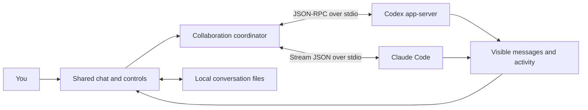

# AI Hub architecture

AI Hub is a native .NET 10 WPF application. Owned child processes host independent agent sessions reconstructed from durable task context at each user work phase; native continuity remains within a phase. Status tasks use isolated workers and shared reports. No browser server, external database, or embedded credentials are needed.

Version 0.10 starts the waiting agent's tool-restricted preparation alongside the first speaker, then supplies the first response and latest context before that agent's speaking turn. Execution ownership remains separate from preparation and speaking order. Task-bound shared work claims support conservative reuse backed by captured evidence; independent review still requires fresh evidence. Identical scoped snapshots are reused only within one context rendering operation. See [the 0.10 design and verification](CONCURRENT-COLLABORATION-0.10.0.md).

The collaboration pipe accepts up to four authenticated connections for one dispatch so provider resume initialization does not block behind an existing connection. All connections retain the same task/provider/session/generation authority and shared call/repair limits. Shutdown explicitly disconnects each instance and joins its serving task.

## Exchanges

Main conversation and editing turns are serialized; explicit split-research workers and independent read tasks can overlap. `CollaborationScheduler` honors explicit recipients, rotates the first speaker on unaddressed new phases, and allows optional peer contributions or quiet passes. Each provider receives the user assignment and current shared state, including the preceding contribution when available. Native sessions remain distinct. Validated structured messages drive handoffs and review; prose control phrases apply only to legacy unstructured mode. Simple social/exact-answer requests avoid a redundant peer dispatch. The host bounds exchanges without a separate coordinator model.

The window supplies complete task transcript entries through a cancellation-aware dispatcher snapshot. Structured dispatches persist canonical original records, distinguish user instructions from agent claims, and construct a deterministic common task core plus assignment detail. Exact host inputs, common hashes, byte counts, included/partial/omitted IDs, generation, and outcomes are persisted before/after each call. Parallel researchers receive one frozen common snapshot; their findings enter the dependent continuation automatically. Bounded task-scoped tools retrieve original detail. Legacy unstructured mode retains a session cursor of hashes for fully supplied unchanged messages only; omitted, partial, edited, and mid-turn arrivals remain eligible. Delivery records never prove comprehension.

`CollaborationGuard` stops whole-message greetings and acknowledgements after one shared answer unless it explicitly hands off. It checks for requests for the user after every reply, before dispatching the peer. Explicit completion/pass and repeat checks prevent unnecessary exchanges. New tool activity or new numerical evidence avoids the repetition heuristic. Quote/code examples are not completion declarations. Each automatic run has a host-enforced cap of six rounds by default, configurable from 1–50. This bound applies even if providers ignore the completion convention or keep producing varied chatter. These are practical heuristics plus a deterministic bound, not a semantic proof that all useful work is finished.

Automatic pauses dispose owned clients, preserve native session IDs, and emit a dedicated pause event. The interface saves a reason in the room, adds a visible notice, and presents appropriate next actions. An explicit new message or continuation starts a fresh guarded run. Counter increments do not depend on whether any status observer is subscribed.

Peer messages are explicitly identified as another agent's output rather than new user authority. Each adapter supplies a collaboration instruction that discourages impersonation, fabricated tool results, repetitive agreement, and unrelated tasks. Actual permissions are enforced by the CLIs, not these instructions alone.

A new user work phase cancels the previous exchange and disposes its owned processes before reconstructing fresh native sessions from canonical task state. Within-phase handoffs and repairs retain native continuity. Narrow progress questions are answered by the host without cancellation or a model call. Stop affects only owned child process trees; it does not terminate unrelated provider sessions. Switching rooms leaves independent workers running; settings changes and window close stop affected workers. A provider failure prevents dependent continuation. Completed edits are not rolled back.

## Project status ownership and memory

`MainWindow` routes the explicit Check status action and narrow whole-message aliases to `HubCoordinator.SubmitProjectStatusAsync`. It supplies a separate factory with read-only `AgentOptions` and no room session IDs. `ProjectStatusWorkflow` runs on a worker task, reports ownership/stages through existing UI dispatch, and schedules one inspection followed by a targeted review. A single-agent target gets only an inspection. Status operations never enter the automatic exchange loop. Continue after stopping a status operation routes back to this workflow.

`ProjectStatusStore` keys data by normalized absolute workspace path. Its open `FileStream` with `FileShare.None` is the ownership claim across app processes using the same data directory. A second request waits with cancellation support, then checks the saved report again. The claim remains held through provider disposal; process exit releases it. The lock file is never deleted. Alternate aliases/junction paths are not treated as a single physical workspace, and this claim does not serialize ordinary conversation editing tasks.

`ProjectSnapshot` hashes in-scope file contents plus a sorted manifest and available Git HEAD, branch and index state. Git listing respects tracked/non-ignored paths in the selected folder; a non-Git walker excludes documented generated/dependency directories. It applies count/size limits and refuses reuse for incomplete coverage, unreadable or linked paths. Matching pre/post snapshots are required to save the report. Cache lookup also checks workflow version, requested participants, inspector, model/executable configuration and a 30-minute maximum age. These are point-in-time source checks, not a filesystem transaction or evidence that external services/environment stayed unchanged.

Each inspection/review owns a fresh native client, disposed before its role returns. Native Session events never reach room persistence. Raw structured response messages are withheld from chat until the host validates their bounded schema and cited paths; tool and usage events remain live. The reviewed artifact stores both viewpoints and original provider usage fields. Missing evidence is displayed as an unverified claim. Paths/hashes are host-checked; natural-language conclusions and claimed test results remain agent-reported.

Cancellation is checked before accepting responses and immediately before atomic report replacement. Run-epoch guards suppress events from superseded coordinators. A delayed canceled worker cannot overwrite the saved result, and cannot release ownership before it returns/disposes. A canceled/failed/changed-source run does not publish a complete new report. Unsupported/corrupt cache data is refreshed. This implementation uses one latest JSON report, not a general task database.

Archive keeps the report. Conversation deletion acquires the same workspace claim and clears the latest report only when its SourceRoomId matches the deleted conversation, before removing the transcript/log. If a lock cannot be acquired within 10 seconds, deletion is canceled with the room intact. Failure later in transcript/log deletion can leave derived cache cleared while retaining the conversation; that cache is reconstructible. Forget saved status clears only the report. Previously displayed report copies in other conversations and provider-native history remain outside that deletion.

The application window owns a registry of room workers. The selected conversation observes one worker; changing selection detaches the view without disposing its coordinator. Status work also survives a view change. Events must match the room's registered coordinator before they can update that room's transcript, sessions or activity. Selected-room controls are updated separately from background persistence.

## Durable tasks and background ownership (0.6.0)

`TaskMemory` stores multiple task records in `tasks.json` through `LocalStore`. It is constructed once per application profile after `AppInstanceLease` has excluded other app writers. A task records its source room, normalized workspace, objective, state, active speaker, monotonically increasing run generation, timestamps, up to 1,024 user notes and the latest bounded reply per agent. Records are copied for reads; failed atomic writes roll in-memory state back. Corrupt records use the existing recovery backup mechanism. Startup marks saved Running records Interrupted, clears their owner and never dispatches a worker.

`HubCoordinator.SubmitAsync` commits a claim before invoking a provider. Claims use a generation and random nonce. The registry rejects a duplicate live task claim and another editing claim for the same normalized workspace; independent reads can overlap. Each speaker takes ownership before sending, and only that owner and current claim may publish its reply. The run releases its claim in its final cleanup. Stop's five-second wait does not authorize a replacement editor while a delayed old run still owns its claim. A stopped worker cannot publish a late result. Native session initialization also receives the task ID in the room configuration signature; selecting another saved task explicitly resets native sessions and context cursors.

Briefings contain only the selected task's objective, six recent notes and bounded latest agent reply excerpts, below 12,000 characters. They are labeled historical and agent-reported and defer to current user instructions. `SavedMessage.TaskId` scopes the conversation entries supplied to that task. Existing untagged history is associated when its first durable task is created; an explicit New task instead creates a separate room. Notes are not promoted into general project facts. Agent completion statements remain recorded claims; ending an exchange is not evidence that the user's objective has been verified complete.

`MainWindow.Tasks.cs` provides the workspace task inspector, note editor, explicit task selection and Stop task. Pending input callbacks belong to their room and coordinator, survive selection changes, and reuse the same live `MessageView` when the user returns. The composer considers only the selected room's requests. Background requests are counted in the project task panel; answering never broadcasts to another worker. Stop all and application shutdown stop all registered coordinators. Archive/delete stop the affected room; archiving keeps records, while deletion removes its task records under the registry gate and restores them on an ordinary conversation-deletion failure.

This initial registry deliberately retains atomic JSON under the existing exclusive application owner. It does not implement SQLite transactions, distributed claims, dependency scheduling or semantic project retrieval. Conversation and task files are separate atomic writes: a process/OS interruption during deletion can leave orphan task records, which the inspector hides when their source room is missing. Normal write failures restore task notes; this is not a crash-atomic multi-file transaction. Workspace editing exclusion is keyed by the normalized path and does not identify different filesystem aliases as the same physical project. Read tasks may observe changes made by an editor and must verify their conclusions. Workers do not survive application shutdown or restart.

## Structured collaboration (0.7.0)

The optional structured path in `HubCoordinator` uses `CollaborationStore`, a per-task atomic JSON ledger, and a fresh `CollaborationMcpHost` connection for each speaker dispatch. Both providers call the same context, submission and history tools through the stdio bridge. `TaskMemory` ownership, generation and the active dispatch constrain every call. Accepted records and idempotency data are saved together; only successful provider turns can make a peer message pending. The coordinator disposes each dispatch connection/client before transferring speaker ownership and retains the workspace editing claim across the exchange.

Structured terminal messages determine routing; prose does not. Targeted participants, automatic-exchange settings, bounded repair and the configured round cap remain host decisions. Failed/canceled/unresolved requests become interrupted records, and restart never replays them automatically. The ledger preserves referenced history within explicit bounds, and its room-deletion API restores ordinary failed deletions. Task/ledger/conversation files remain separate atomic writes, not a cross-file transaction.

The desktop now configures this backend for ordinary durable tasks. The installed self-contained bridge is under `bridge/`; shared Codex/Claude plugin workflows under `plugins/ai-hub-collaboration/` are loaded into every dispatch. The separate read-only project-status workflow retains its own inspector/reviewer protocol.

`CollaborationEvidence` captures native command and Claude read events with bounded output, source IDs, nullable exit status, and before/after source fingerprints. These are host-captured provider events, not independent host reruns. `get_evidence` reports whether both snapshots match current files; snapshot coverage excludes documented generated/dependency directories and is not a fingerprint of the entire machine or runtime environment. Missing start/end records, file changes, and incomplete coverage disable reuse.

Review results must match the incoming request's file/focus scope and snapshot. Findings retain IDs across open, addressed, and checked states. `mark_addressed` records a fix claim; a different agent needs fresh successful native execution/read evidence to check it. Unresolved or stale findings reject assignment-complete submissions. The host validates evidence linkage and lifecycle, not the semantic truth of every claim.

The desktop renders expandable collaboration cards, exposes task evidence/freshness, exports records, and deletes ledgers through the task-aware deletion wrapper. Unsupported histories are preserved and isolated from dispatch without preventing other tasks from opening. Startup never resumes workers. See [release verification](COLLABORATION-RELEASE-VERIFICATION.md) and the earlier [routing verification](COLLABORATION-ROUTING-VERIFICATION.md) for recovery boundaries.

## Adapters

`JsonProcess` launches executables directly using argument arrays, with no shell interpolation. It handles UTF-8 newline-delimited JSON, correlates pending RPC responses, and keeps stdout/stderr draining while approval decisions are pending.

`CodexClient` performs `initialize`, `initialized`, `thread/start` or `thread/resume`, then `turn/start`. Text deltas and completed messages go to the shared chat. Command output, plans, and file/tool events go to activity. Command, file-change, and permission approval requests appear as chat cards when project editing is enabled. Structured user questions retain their option labels/descriptions, `isOther` and `isSecret` flags. MCP elicitation requests are declined in this first version; unknown request types produce a visible error and protocol error response.

`ClaudeClient` starts Claude Code with `--print`, stream JSON input/output, partial messages, and the stdio permission channel. It initializes the control protocol, sends user messages over the open input stream, and handles assistant text, tool events, results, and `can_use_tool` requests. Normal editing requests are approved once or denied, and `AskUserQuestion` answers are returned through the updated tool input. Private reasoning events are not exposed or stored by AI Hub.

## Questions and permissions in chat

`Approval.Question` converts both providers' structured questions to typed choices. Codex responses remain keyed by question ID with an `answers` array; Claude preserves the original input and keys answers by question text, joining multiple selected labels with comma-space. See the [Codex app-server protocol](https://learn.chatgpt.com/docs/app-server) and [Claude user-input protocol](https://code.claude.com/docs/en/agent-sdk/user-input). The installed Codex CLI's generated `ToolRequestUserInputParams`/`Response` schemas were checked for the option and secret flags.

`MainWindow.Input.cs` owns pending completions per request, room and coordinator. `AgentRequestCard` renders choices and explicit permission buttons inside the message template. A question answer resolves that provider's existing callback, bypassing ordinary `SendAsync` task cancellation/broadcast. The main composer points to one question at a time; `RequestView` holds separate transient answer drafts, while the room's ordinary draft stays untouched. Native multi-question batches are presented sequentially, and requests from separate agents can coexist. No option is selected or sent automatically.

`SavedMessage.Input` retains the original choices and terminal status. A visible user reply includes its recipient. Answers marked secret use a `PasswordBox` and only a placeholder is stored by the host; native providers still receive them. Restored pending records become cancelled, as native callbacks cannot resume after an app restart. Stop/room disposal cancels completions before removing their controls, and duplicate/stale response attempts cannot resolve another request. `InputRequestLifetimes` also cancels UI callbacks when a provider withdraws a request, finishes a turn, exits, or is disposed.

## Persistence and boundaries

`ActivityFeed` is a UI projection of the original events. It retains separate bounded action and diagnostic collections. Tool start, streamed output and completion update one observable `ActivityEntry`, keyed by agent and item ID within that agent's dispatch. Reused IDs across turns and matching IDs from different agents cannot merge. Plan updates share one entry per agent turn. Routine status/token counters and standalone whitespace are diagnostic-only; errors, explicit warnings, approvals, handoffs and project-memory notices remain visible. Claude tool results preserve final/error metadata for reliable completion state; command nonzero exit codes are displayed as reported rather than assumed to mean the same thing for every command.

The agent banners use readable tool descriptions and do not replace them with arbitrary output fragments or heartbeat labels. Selecting an action binds its details dialog to the same observable entry, so output continues updating there. Each entry bounds retained metadata/output to 64,000 characters each and labels shortened content. Both UI collections cap at 200 independently, preventing diagnostic bursts from evicting useful actions. The unfiltered events still reach the existing JSONL log. The Show diagnostics preference persists, and Open full log launches Notepad with one validated literal path argument. This is presentation filtering, not a provider-event collection or on-disk retention change.

`AppInstanceLease` holds an OS file handle before opening any conversation data, allowing only one writer per data directory. A second launch focuses the owner when available, then exits. A crash releases the handle. Settings and conversations use exclusive random temporary files, a disk flush, and atomic replacement; invalid filenames and linked data/log files are rejected. `SavedStateRepair` handles null records/fields, duplicate or unsafe IDs, invalid enums and nested input/cursor data. Unreadable or repaired JSON is preserved with an `.unreadable-<unique-id>` suffix before the next save. Activity uses append-only JSONL. The window saves completed messages immediately and partial text and drafts every four seconds. Room drafts, recipients, last task, pause reason and per-agent context cursors persist along with the last selected room. Provider session IDs survive app restarts. Changing model, workspace, or edit mode starts fresh native sessions while preserving the visible room history. Appearance and round-limit changes do not restart an active session.

The composer uses `PreviewKeyDown` to handle Enter before WPF's multiline text editing consumes it; Shift+Enter passes through to the native newline command. Empty Send actions are disabled. Conversation filtering preserves the active session and draft rather than treating filtering as a room switch.

`Room.IsArchived` defaults to false for older saved rooms. Active and archived rooms share the same store, but the sidebar filters them separately. Opening an archived room builds no coordinator and leaves its draft read-only; restoring it is explicit and never submits a message. Last-selected-room restoration also restores the matching active/archive view.

Archiving and deletion dispose the affected room's owned coordinator before switching rooms. Queued callbacks must match the room's registered worker and coordinator instance, preventing an outgoing run from recreating a deleted log while allowing valid background results in retained rooms. Pending input cards become cancelled through the request token. A window-close request waits for a conversation transition to finish. If removing a room leaves no active conversation, the window creates a new empty one.

Deletion requires a confirmation with **Keep conversation** as the default. `LocalStore.DeleteRoom` rejects unsafe or ambiguous IDs before writing, atomically replaces `rooms.json` without the selected record, and deletes only its exact `activity-<id>.jsonl` file. The resolved log's parent must equal the AI Hub data directory; deletion never enumerates a directory or uses wildcards. If log deletion fails, the prior room list is restored. Project files, other logs, native CLI history, and external backups are outside this operation. Conversation JSON and activity JSONL are separate files, so this is not a crash-atomic transaction across both; an OS/process interruption between writes can leave an orphan log.

The app is a host for provider CLIs, not an independent OS sandbox. Project instructions and installed CLI configuration remain relevant. Model/service limits still apply. Context compaction remains with the providers; AI Hub supplies the bounded unseen shared conversation on every turn. Client registration and detachment are serialized; cancellation invalidates callbacks immediately and cleanup owns a detached client list, so a delayed old pause/failure cannot clear or overwrite a replacement run.

Executable discovery skips empty and relative PATH entries, and the host resolves Git/Notepad to absolute paths. CLI transport limits individual frames and cumulative streamed replies to 4,194,304 characters. Readers report malformed/oversized failures without leaving RPC waiters stuck; disposal is idempotent. Duplicate or missing input IDs fail the turn and cancel waiting questions. At most 16 input requests can wait per provider, with at most 64 choices per question. Git output capture and folder traversal are bounded, and incomplete fingerprints cannot be reused.

This version has no voice interface, cloud synchronization, plugin marketplace, embedded login UI, full MCP elicitation forms, or disk log rotation. Messages render through Markdig into native FlowDocuments, with throttled streaming updates and the original Markdown retained for copying and export. A 100,000-character preview, nesting bound of 32, and 5,000-node rich-text budget constrain rendering; overly complex previews fall back to plain text. HTML is treated as text, remote images are not fetched, and only HTTP(S) links open from an explicit click. The Windows x64 package bundles Microsoft-signed .NET 10.0.12 runtime components; AI Hub's own executable remains unsigned. Bundled runtimes require package updates to receive future patches.

## Visual system

`App.xaml` merges `Themes/DesignTokens.xaml` and `Themes/Controls.xaml`. Semantic brushes and bundled font families are shared with generated Markdown and dialogs through `Theme`. `HubIcon` renders bundled Lucide SVG geometry directly. `CollaborationLink` draws an original native instrument and animates a short signal only on a real peer dispatch. Agent status and tool summaries are derived from coordinator/provider events; pending approval is explicitly labeled.

`Motion` centralizes entrance, hover, and status animation and respects reduced motion and Windows animation preferences. The shell has one staggered entrance sequence. Continuous effects use a 30 fps limit and stop when minimized. Conversation messages have a maximum reading width; existing scroll-follow behavior is retained. Below 1280 device-independent pixels the timeline hides automatically unless the user has explicitly chosen its visibility for the current window. Hidden activity content is collapsed and excluded from interaction. Approval requests reveal the timeline.

The custom title bar uses WPF WindowChrome to retain native dragging and resizing. Sora and IBM Plex Sans are embedded WPF resources, with their OFL licenses distributed alongside the app. The redesign adds no provider-protocol changes, browser dependency, remote visual assets, or animation service. See `DESIGN.md` for the direction and design critique.

## 0.11.0 source and import storage

Large pasted messages keep exact originals in task-scoped source JSON outside the 8 MiB ledger. Common context carries bounded previews, hashes and retrieval IDs; read_context_source supplies exact ranges or full-source search matches. Source I/O and freshness hashing occur outside the task/store locks with ownership checked again afterward. Ordinary user instructions retain their authority; quoted transcript content remains source data. Partial previews never count as complete cursor delivery.

WorkspaceImports streams imported files into the selected workspace with CreateNew collision protection and SHA-256 verification metadata. The desktop adds references to its saved draft without starting a provider. Imported files are normal project files and are outside conversation deletion. Profile source files belong to the task: deletion enumerates only its validated source-<task-id>-*.json prefix, restores files on ordinary deletion failure, and retains the existing multi-file crash-atomicity limitation.
